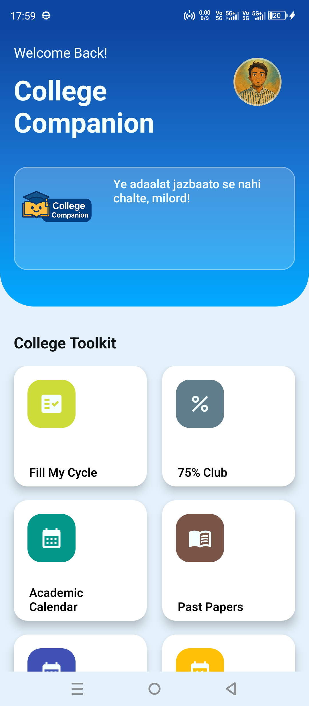
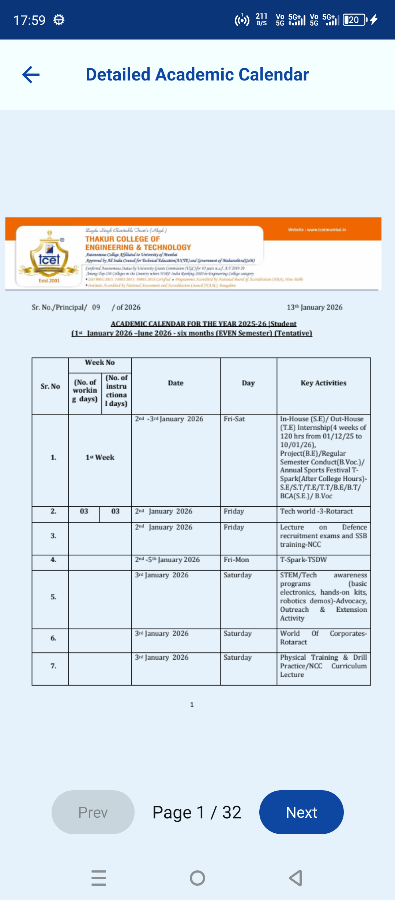
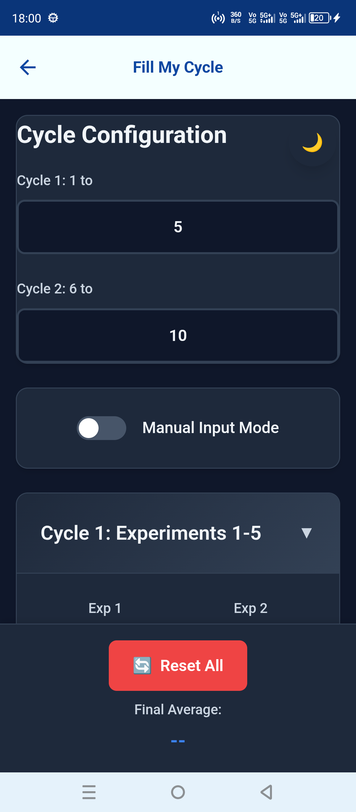
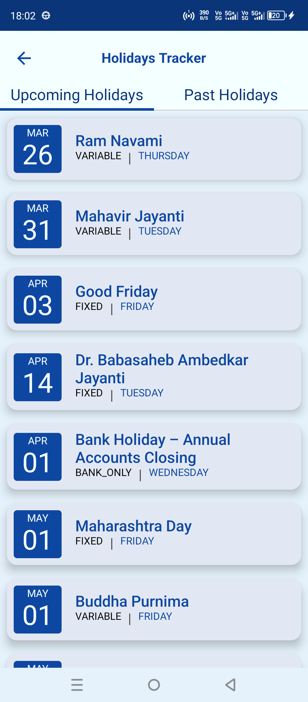
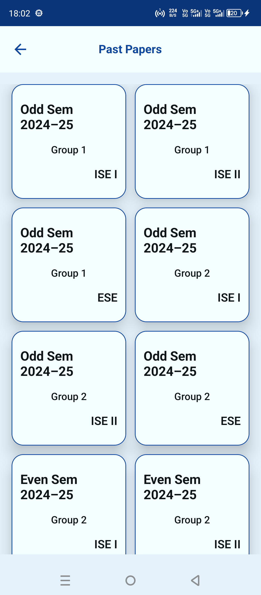
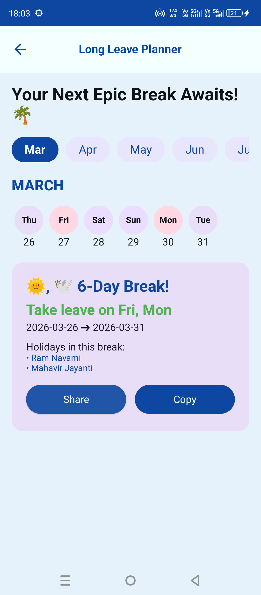

# CollegeCompanion

  

## Concise Project Overview
CollegeCompanion is an Android app built to make student academic life simpler by centralizing semester-related resources in one place. Instead of repeatedly searching through chats, portals, and file links, users can quickly access important planning documents directly inside the app. A major focus of this project is smooth in-app PDF access with practical caching behavior so commonly used documents open faster while still supporting content updates.

## Key Features
- Semester plan focused workflow designed for quick student access.
- In-app PDF viewing experience for academic documents.
- Local cache usage to reduce repeated downloads and improve opening speed.
- Update-aware document handling to support newer PDF versions when source links change.
- Clean Android project setup with debug/release build support.
- Firebase-enabled project configuration (`app/google-services.json` present).

## Tech Stack & Tools
- **Language:** Kotlin
- **Platform:** Android
- **Build System:** Gradle (Kotlin DSL)
- **UI:** Modern Android UI stack (Compose-oriented project direction)
- **Document Rendering:** Android PDF rendering APIs
- **Backend/Services:** Firebase (configured in app module)
- **Analytics & User Insights:** Microsoft Clarity, Firebase Analytics
- **IDE:** Android Studio
- **Version Control:** Git + GitHub

## Screenshots

<table>
  <tr>
    <td align="center"><b>Dashboard</b></td>
    <td align="center"><b>Semester Plan</b></td>
    <td align="center"><b>Lab Evaluation Sheet</b></td>
  </tr>
  <tr>
    <td></td>
    <td></td>
    <td></td>
  </tr>
  <tr>
    <td align="center"><b>Holiday Tracker</b></td>
    <td align="center"><b>Past Papers</b></td>
    <td align="center"><b>Long Leave Planner</b></td>
  </tr>
  <tr>
    <td></td>
    <td></td>
    <td></td>
  </tr>
</table>

## Play Store Link

  

## About Me

Hi, I’m **Kaustubh Suryakant Deshpande** — a 3rd‑year B.Tech student specializing in **Internet of Things (IoT)** at Thakur College of Engineering and Technology, Mumbai.  
I’m passionate about building **robust, crash‑free Android and Kotlin Multiplatform (KMP) apps and libraries**, with a strong focus on **clarity, reproducibility, and collaborative workflows**.

### What I Do
- Develop Android/Kotlin projects with **Jetpack Compose, Material 3, MVVM architecture, Hilt DI, Coroutines, and Flows**
- Explore and contribute to **Kotlin Multiplatform (KMP)** projects, including shared logic, Room database integration, and Compose Multiplatform UI
- Contribute to open‑source projects (Calf KMP library, CI/CD workflows, Kotlin ecosystem mentorship)
- Design **secure CI/CD pipelines** with GitHub Actions & Netlify, emphasizing secrets management and reproducibility

### Current Goals
- Preparing **Google Summer of Code (GSoC)** proposals focused on Kotlin education, workflow automation, and multiplatform development
- Actively participating in **Kotlin workshops** and hackathons to stay aligned with ecosystem practices
- Building a professional identity as an Android/Kotlin developer with measurable impact across platforms

## Connect With Me

  
  
  

---
*I believe in clarity, reproducibility, and thoughtful collaboration — values that guide both my code and my career.*

